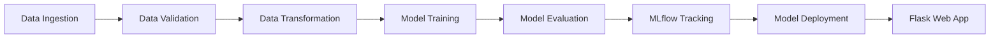

# 🍷 Wine Quality Prediction - Complete ML Pipeline

<div align="center">


**An end-to-end Machine Learning pipeline for predicting wine quality, from data ingestion to model deployment with MLflow tracking and Flask web interface.**

</div>

---

## 📋 Table of Contents

- [Overview](#-overview)
- [Features](#-features)
- [Project Structure](#-project-structure)
- [ML Pipeline Workflow](#-ml-pipeline-workflow)
- [Tech Stack](#-tech-stack)
- [Installation](#-installation)
- [Usage](#-usage)
- [MLflow Tracking](#-mlflow-tracking)
- [Deployment](#-deployment)
- [License](#-license)

---

## 🎯 Overview

This project demonstrates a complete production-ready machine learning pipeline for predicting wine quality based on physicochemical properties. The pipeline follows industry best practices with modular design, experiment tracking using MLflow, and a user-friendly web interface built with Flask.

**Key Highlights:**
- ✅ End-to-end ML pipeline (data ingestion → deployment)
- ✅ Modular and scalable architecture
- ✅ MLflow & DagsHub integration for experiment tracking
- ✅ Interactive web UI for predictions
- ✅ Docker support for containerized deployment
- ✅ Comprehensive Jupyter notebooks for research

---

## ✨ Features

### 🔧 Core Pipeline Components
1. **Data Ingestion** - Automated data loading and initial processing
2. **Data Validation** - Schema validation and data quality checks
3. **Data Transformation** - Feature engineering and preprocessing
4. **Model Training** - Scikit-learn model training with hyperparameter tuning
5. **Model Evaluation** - Performance metrics tracking with MLflow

### 🚀 Additional Features
- **Web Interface** - Beautiful Flask-based UI for predictions
- **Experiment Tracking** - MLflow integration with DagsHub
- **Research Notebooks** - Complete analysis in Jupyter notebooks
- **Configuration Management** - YAML-based configs (config.yaml, params.yaml, schema.yaml)
- **Docker Support** - Containerized deployment ready

---

## 📁 Project Structure

```
DataScience_Complete_ML_Pipeline/
│
├── .github/workflows/      # CI/CD workflows
├── config/                 # Configuration files
│   ├── config.yaml        # Project configurations
│   ├── params.yaml        # Model parameters
│   └── schema.yaml        # Data schema
├── research/               # Jupyter notebooks for experimentation
│   ├── data_ingestion.ipynb
│   ├── data_validation.ipynb
│   ├── data_transformation.ipynb
│   ├── model_trainer.ipynb
│   ├── model_evaluation.ipynb
│   └── reasearch.ipynb
├── src/datascience/        # Main source code
│   ├── components/         # Pipeline components
│   │   ├── data_ingestion.py
│   │   ├── data_validation.py
│   │   ├── data_transformation.py
│   │   ├── model_trainer.py
│   │   └── model_evaluation.py
│   ├── config/             # Configuration manager
│   ├── constants/          # Constants
│   ├── entity/             # Data entities
│   ├── pipeline/           # Training & prediction pipelines
│   └── utils/              # Utility functions
├── static/                 # Static files for web UI
├── templates/              # HTML templates
│   └── index.html
├── mlruns/                 # MLflow experiment tracking
├── app.py                  # Flask web application
├── main.py                 # Main training script
├── requirements.txt        # Python dependencies
├── setup.py                # Package setup
├── Dockerfile              # Docker configuration
└── README.md               # This file
```

---

## 🔄 ML Pipeline Workflow



### Pipeline Steps:

1. **Data Ingestion** → Load wine quality dataset
2. **Data Validation** → Validate against schema.yaml
3. **Data Transformation** → Feature engineering and preprocessing
4. **Model Training** → Train ML models with scikit-learn
5. **Model Evaluation** → Evaluate and log metrics to MLflow
6. **Deployment** → Serve via Flask web interface

---

## 🛠 Tech Stack

| Category | Technologies |
|----------|-------------|
| **Language** | Python 3.8+ |
| **ML Framework** | scikit-learn |
| **Experiment Tracking** | MLflow, DagsHub |
| **Web Framework** | Flask, Flask-Cors |
| **Data Processing** | pandas, numpy |
| **Visualization** | matplotlib |
| **Configuration** | PyYAML, python-box |
| **Development** | Jupyter Notebook |
| **Deployment** | Docker |

---

## 🚀 Installation

### Prerequisites
- Python 3.8 or higher
- pip package manager
- Git

### Setup Steps

1. **Clone the repository**
```bash
git clone https://github.com/Deepuhemant/DataScience_Complete_ML_Pipeline.git
cd DataScience_Complete_ML_Pipeline
```

2. **Create virtual environment**
```bash
python -m venv venv
source venv/bin/activate  # On Windows: venv\Scripts\activate
```

3. **Install dependencies**
```bash
pip install -r requirements.txt
```

4. **Install the package**
```bash
pip install -e .
```

---

## 💻 Usage

### 1. Train the Model

Run the complete training pipeline:

```bash
python main.py
```

This will execute all pipeline stages:
- Data Ingestion
- Data Validation  
- Data Transformation
- Model Training
- Model Evaluation

### 2. Start the Web Application

Launch the Flask web interface:

```bash
python app.py
```

Access the application at: `http://localhost:8080`

### 3. Make Predictions

The web interface provides:
- **Train Button**: Trigger model training
- **Prediction Form**: Input wine properties to get quality predictions

**Input Features:**
- Fixed Acidity
- Volatile Acidity
- Citric Acid
- Residual Sugar
- Chlorides
- Free Sulfur Dioxide
- Total Sulfur Dioxide
- Density
- pH
- Sulphates
- Alcohol

**Output:** Wine quality score (0-10)

---

## 📊 MLflow Tracking

This project uses **MLflow** integrated with **DagsHub** for experiment tracking.

### View Experiments

```bash
mlflow ui
```

Open `http://localhost:5000` to view:
- Model parameters
- Performance metrics (RMSE, MAE, R²)
- Artifacts and models
- Experiment comparisons

### Tracked Metrics
- **RMSE** (Root Mean Square Error)
- **MAE** (Mean Absolute Error)
- **R² Score** (Coefficient of Determination)

---

## 🐳 Deployment

### Docker Deployment

1. **Build Docker image**
```bash
docker build -t wine-quality-predictor .
```

2. **Run container**
```bash
docker run -p 8080:8080 wine-quality-predictor
```

Access at: `http://localhost:8080`

---

## 📝 Development Workflow

For adding new features or modifications, follow these steps:

1. Update `config.yaml` with new configurations
2. Update `schema.yaml` for data validation rules
3. Update `params.yaml` for model hyperparameters
4. Update the entity in `src/datascience/entity/`
5. Update the configuration manager in `src/datascience/config/`
6. Update the components in `src/datascience/components/`
7. Update the pipeline in `src/datascience/pipeline/`
8. Update `main.py` to include new pipeline stages

---

## 📄 License

This project is licensed under the **GNU General Public License v3.0** - see the [LICENSE](LICENSE) file for details.

---

## 🤝 Contributing

Contributions are welcome! Please feel free to submit a Pull Request.

---

## 📧 Contact

**Author:** Deepuhemant  
**Repository:** [DataScience_Complete_ML_Pipeline](https://github.com/Deepuhemant/DataScience_Complete_ML_Pipeline)

---

<div align="center">

**⭐ If you find this project helpful, please give it a star! ⭐**

</div>
